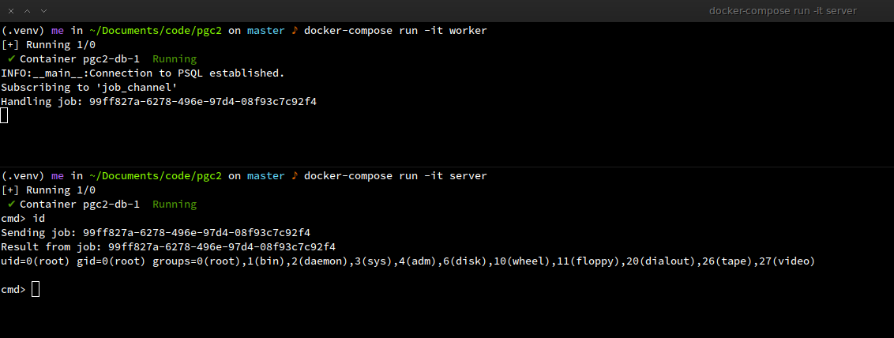

# pgc2

pgc2 is a toy C2 channel example which leverages PostgreSQL's [LISTEN](https://www.postgresql.org/docs/current/sql-listen.html) and
[NOTIFY](https://www.postgresql.org/docs/current/sql-notify.html) statements to
transfer comands to execute to the implant and writing output back to the
database for later display.

As this is just a toy example, pgc2 is currently only a barebones experiment.

## How to play

1. Clone the repository: `git clone https://github.com/cydave/pgc2.git && cd pgc2`
2. Build the docker images: `docker-compose build`
3. Run the database server: `docker-compose up db -d`
5. Run the server ("operator") in a new terminal: `docker-compose run -it server`
4. Run the worker ("implant"): `docker-compose up worker -d`
6. Invoke shell commands in the operator, the `cmd>` prompt will send a new job to execute on the implant and should print out the output.
